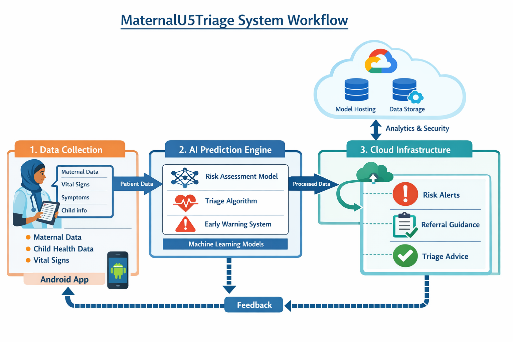

## MaternalU5Triage System Workflow Diagram

### Expanded Description

The MaternalU5Triage workflow diagram illustrates the end-to-end architecture of the AI-assisted maternal and under-five clinical decision support system.

The system integrates mobile data collection, machine learning prediction models, and cloud infrastructure to assist frontline health workers in identifying high-risk maternal and child health cases in primary healthcare facilities.

### 1. Data Collection Layer (Mobile Application)

Health workers collect patient information using a mobile application developed with Android Studio.

The application captures essential clinical and demographic indicators including:

- Maternal health information
- Child health indicators
- Vital signs
- Reported symptoms
- Basic demographic data

This data is entered directly at the point of care during antenatal visits, child consultations, or emergency assessments.

The mobile interface is designed to function in low-resource environments and supports structured data entry to improve data quality and standardization.

### 2. AI Prediction Engine

Once patient data is captured, the system processes the information through a set of machine learning models designed to detect early warning signs of maternal or child health risks.

The AI engine includes:

**Risk Assessment Models**
Machine learning algorithms trained on maternal and child health indicators to classify cases into risk categories.

**Triage Algorithm**
A rule-based and predictive system that determines urgency levels and prioritizes patients requiring immediate medical attention.

**Early Warning System**
Predictive signals that alert health workers to potential complications such as severe maternal conditions or critical child health indicators.

### 3. Cloud Infrastructure Layer

The system is designed to deploy on Google Cloud infrastructure to ensure scalability, secure data processing, and centralized analytics.

The cloud layer supports:

- Model hosting for AI prediction services
- Secure storage of health data
- Data analytics pipelines
- System monitoring and updates

Cloud infrastructure allows health programs and researchers to monitor trends and improve the performance of the AI models over time.

### 4. Decision Support Output

After analysis, the system generates actionable decision-support guidance for health workers.

Outputs may include:

- Risk alerts indicating high-risk maternal or child cases
- Referral recommendations for escalation to higher-level health facilities
- Triage guidance to help prioritize care

These recommendations support health workers in making faster and more informed clinical decisions.

### 5. Continuous Feedback Loop

The system includes a feedback mechanism where outcomes and new patient data can be used to continuously improve model accuracy and system performance.

This allows the AI system to evolve and adapt as additional real-world health data becomes available.

---

### Intended Impact

The MaternalU5Triage system aims to strengthen frontline healthcare delivery by:

- Supporting early detection of maternal complications
- Improving triage and referral decisions
- Reducing delays in care
- Enhancing maternal and under-five survival outcomes in low-resource settings
